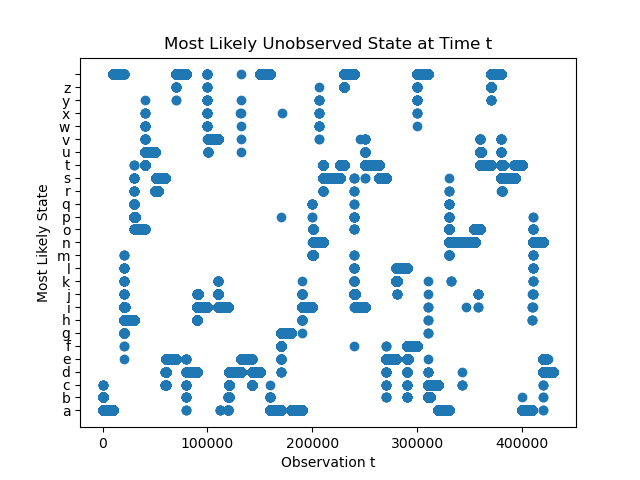

Uses the Viterbi Algorithm to compute the most likely sequence of hidden states within a Hidden Markov Model given observations, an initial state distribution matrix, transition matrix, and emission matrix. The hidden states spell out a hidden phrase. To run the program, just run [viterbi.py](viterbi.py)

